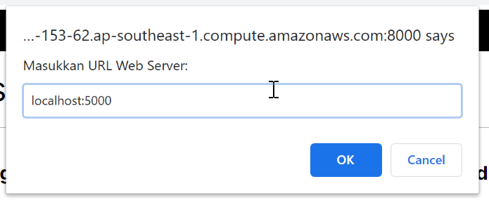

# How to use this project (Notes App)

--> Project created by **Dicoding**

--> Structure Backend Website Project (Notes App)

```
notes-app-back-end-1
├── node_modules
├── src
│ ├── handler.js
│ ├── notes.js
│ ├── routes.js
│ └── server.js
├── .eslintrc.json
├── package-lock.json
└── package.json
```

---

### A. Setup Frontend Website
1. Download this frontend website project, open this link in browser.

```bash
https://github.com/dicodingacademy/notes-app-frontend/archive/refs/heads/v1.zip
```
2. Setup your project, open project with text editor.
3. In Terminal/CMD install frontend website project, build project, and run frontend website.

```bash
npm install
npm run build
npm run start
```

4. Open website in browser with local url.

```bash
http://localhost:8080
```

---

### B. Auto Setup Backend Website 

1. Install all packages.

```bash
npm install
```

2. Run backend website 

```bash
# if use virtual private server
npm run start:prod

# if use vscode
npm run start:dev
```

<details>
<summary>3. Connect frontend website with backend REST API</summary>

- 

- 

- 


</details>

---

### B. Manual Setup Backend Website (Optional)
_(If you want run in VSCode)_

1. Install nodemon tools.

```bash
npm install nodemon --save-dev
```

---

#### # Setup eslint (Optional) 

2. Install package eslint.

```bash
npm init @eslint/config@latest
```

3. Aswer question like this,

```bash
-> How would you like to use ESLint? -> To check syntax and find problems.
-> What type of modules does your project use? -> CommonJS (require/exports).
-> Which framework does your framework use? -> None of these. 
-> Does your project use TypeScript? -> No.
-> Where does your code run? -> Node (pilih menggunakan spasi).
-> Would you like to …… (seluruh pertanyaan selanjutnya) -> Y.
```

4. Install eslint dicoding.

```bash
npm install --save-dev eslint-config-dicodingacademy
```

5. Add this code in file ``eslint.config.mjs``.

```mjs
import js from "@eslint/js";
import globals from "globals";
import { defineConfig } from "eslint/config";
import daStyle from "eslint-config-dicodingacademy"; // Import member from eslint-config-dicodingacademy


export default defineConfig([
  daStyle, // add member in this value export
  { files: ["**/*.{js,mjs,cjs}"], plugins: { js }, extends: ["js/recommended"] },
  { files: ["**/*.js"], languageOptions: { sourceType: "commonjs" } },
  { files: ["**/*.{js,mjs,cjs}"], languageOptions: { globals: {...globals.browser, ...globals.node} } },
]);
```

6. Install extensions **ESLint** (if you use VSCode), Restart Eslint.

---

#### # Setup Hapi Framework

7. Install **Hapi** package with **npm**.

```bash
npm install @hapi/hapi
```

8. Run backend website 

```bash
# if use virtual private server
npm run start:prod

# if use vscode
npm run start:dev
```
<details>
<summary>9. Connect frontend website with backend REST API</summary>

- 

- 

- 


</details>

---